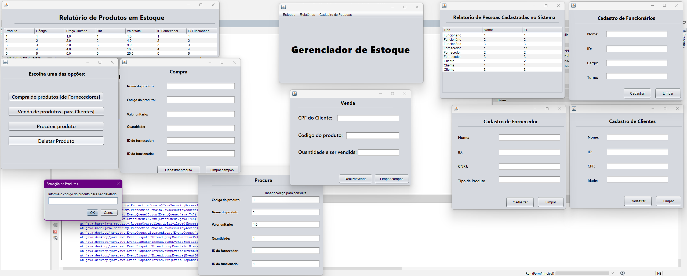

<h1>Projeto de Programação Orientada a Objetos - Gerenciador de Estoque de Supermercado</h1>

No sistema, é possível realizar compra e venda de produtos que serão dispostos em uma lista. Além disso, pode-se realizar a consulta e a deleção de itens já existentes, podendo também cadastrar pessoas que podem ser separadas em funcionários, clientes e fornecedores

 <figure>
  
  <figcaption>Layout das funcionalidades do sistema [windows]</figcaption>
 </figure>

